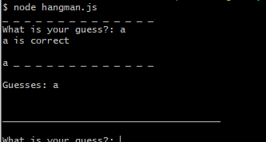
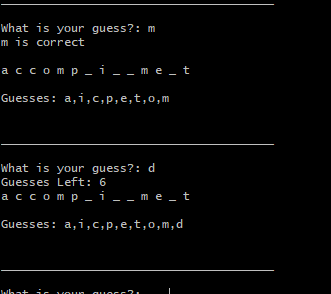
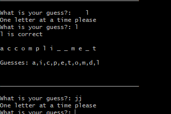
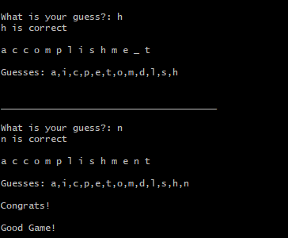
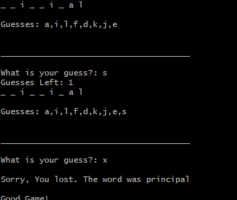

# Node HangmanCLI

## Description



A basic CLI interface produces a line of blanks to show how many letters are left. One line accumulates guesses.



As guesses accumulate correct answers are replaced in the masked string.
Incorrect guesses that are not already in the guess list will increment the incorrect index and show you how many wrong guesses you have left.



If you multiple strings of inputs are entered it will prompt the user to please enter one letter at a time.



Once all the blanks have been filled, the game will end and congratulate you.



If however you use up all your guesses, the game will tell you and inform you of your word.

## Installation

Clone Repo and run locally

```bash
git clone https://github.com/PaulMorioni/node-CLIhangman
```

## Usage

From directory run

```bash
node hangman.js
```
